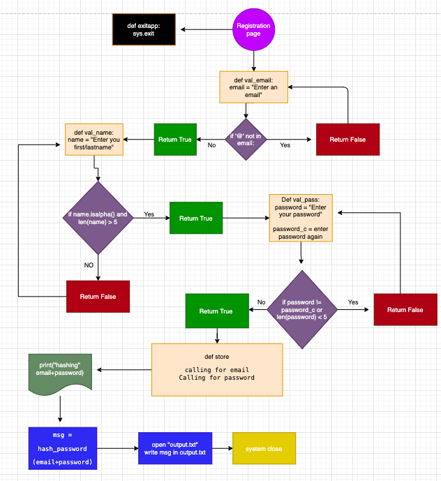
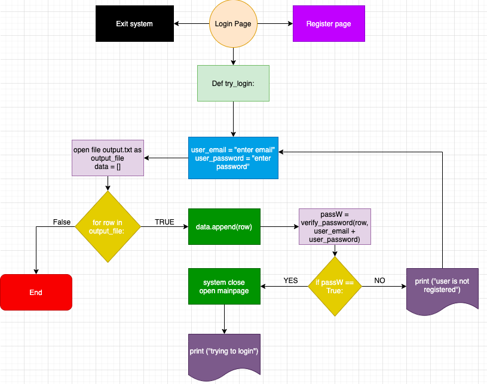
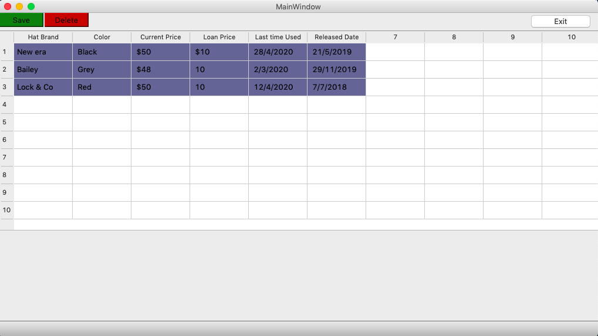
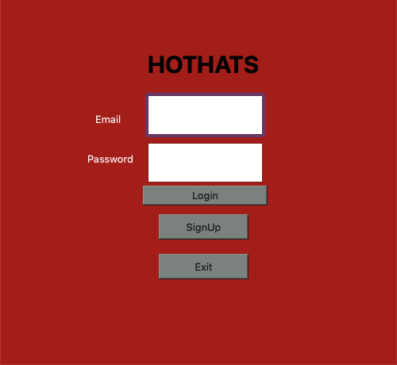
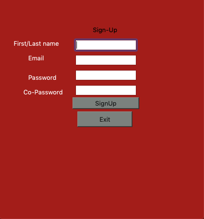
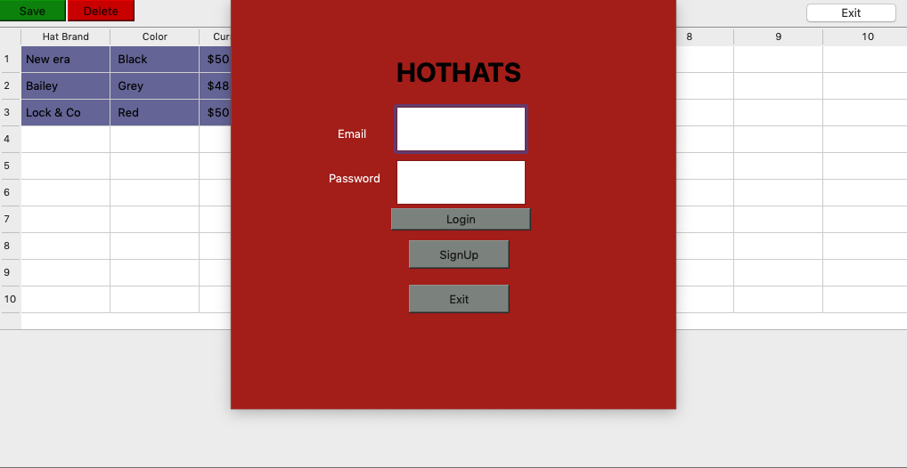
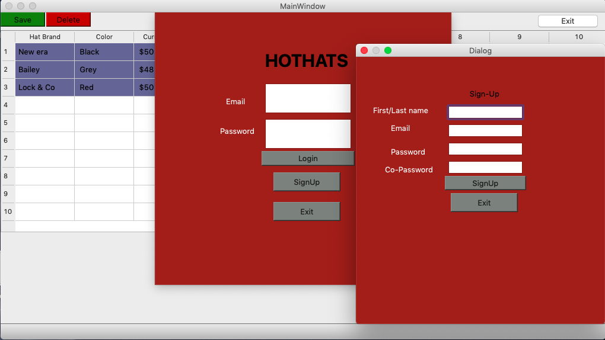
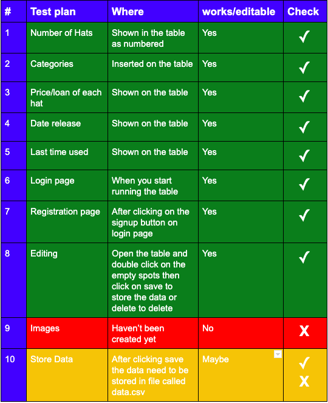

# Inventory App (Python)

Contents
-----
  1. [Planning](#planning)
  2. [Design](#design)
  3. [Development](#development)
  4. [Evalution](#evalution)
  
  Planning 
  ----------
  
  ## Definition of the Problem
A Company called HOTHAT is starting to open a business, they want to sell hats and also rent them to people for a day or so. This company has a lot of hats, and thier hats have different colors, prices, and release date and due to thier client's needs they provide a specific hat that they require. 

Kelven who is the owner of HOTHAT Company emailed me to help him keep track on how his Company. He stated in his emial that his company is having a diffucult time managing to know exactly how many hat they have. Kelven stated that sometimes his company loses track on hats and for result, they lose hats in the process. Kelven is afraid that he is afraid that his company will lose a lot of money if they keep losing hats which is bad for his business. So in order for his company to run smoothly and have a easy time managing all the hats that they either sell, rent or keep, he requires an application that will solve his problems like an Inventory. To know more about kelven's request, READ Client Request  
  
  ## Client Request (Directly from His Email)
"I would like to start a business company, called Hot Hats, and in my house, I already have a set of Hats. At this instant, I do not identify a way to know the number of hats that I have. The hats present different brands, colors, and styles and popularity. Besides registering these categories, I want the program to provide the current price, release date, loan price and last time used. Additionally, I want the system to be only assessed by me or the people who would work with me"


  ## Proposed Solution
To solve HOTHAT Company's problem we need to understand and figure out what kind of inventory a company like them will need. 
A simple inventory that divides into categories and those categories will have color, price, release date, rented hats, and
last time that it have been used. To make this possible, we will divide all the hats into the categories that the company requested and some of the categories will have sub class which will make it more easier. For example, Color catergory will have a sub class that shows different colors within that category. We will also create a search button that will make everything easier for Kelven and his company. Another feature that we will add is log in and registration so that only him or his workers could log in or use. Overall, the inventory need to be simple and easy to use by anyone in his company. 

 ## Record of Tasks
 
 The record of task contains the five steps in the design process: Planning, Design, Developement, testing, and implementaion
 
 
| __Task no__ | __Planning Action__ | __Expected Outcome__ |__Time Estimated__ |__Target Completion__ |__Criteria__ |
|-------------|---------------------|----------------------|-------------------|----------------------|-------------|
| 1        | Meeting with Client About a request he need   |  have a clear idea on what he wants his inventory to have and have a system sketch to create his inventory                    | 10 mins           | Feb 20th, 2020      |       A     |
|  2 | Defining the problem | Have a clear defined problem so that its easy to follow everything that need to be solved. its also an easy way to present when giving the client his application | 1 Hour|Feb 25nd, 2020 |A|
| 3     | Writing Solutions on Clients's request | There need to a clear solution at the end of this plan, and have everything that we need to start this application |1 Hour | Feb 28th, 2020| A |
| 4       | Creating Success Criteria |   I wanted to have a clear understandig on all the success criteria that I needed to meet in order to finish this program                | 10 mins           |feb 25th 2020| A| 
| 5        | Designing the application Using Qt Designer   |  Application form need to be done and at the end of this session, the application need to be ready for coding                    | 1 Hour           | March 10th, 2020                 |       C     |
| 6        | Converting the ui app file into python files  | I need to have python files that I can use for pycharm so that I can make the application work and have all the behaviours that the client requested  | 10 mins  | March 14th, 2020  | C |
| 7       |Create a mainapplication to unite all libraries for login, sighn, and mainpage| This mainapplicaiton will run the application as one| 1 Hour and 30 mins| April 3rd, 2020|C|
| 8        |Coding button Behavior| Whenever the buttons like login, signup, or exit clicked, they need to do exactly what they are intended to do. In this case, login need to take you into the inventory page, and signin need to take you to registration page while exit button cancels the application. | 1 Hour | April 6th, 2020| C |
| 9        |Reading a data File | withdraw data from another file which can help me store the data in my app | 30 mins | April 12th, 2020 | C |
| 10        | Designing the system Diagram | This will help me have a clear idea on what the application will look like and it will give the reader a cler over view of the app | 30 min | April 15th, 2020 | B |
| 11        | Coding for the login page | This will help the application to function properly and allow the user to login and log out of the system as he pleases  | 30 mins | April 23rd, 2020 | C |
| 12        | Creating the delete and save buttons for the main page | These two buttons will help the user alter data which is saved in their table | 20 mins | April 23rd, 2020 | C |


  ## Success Criteria
  These are all the criteria that our inventory will need to have
  1. Finding how many hats the client has.
  2. Categories for Brand, color, styles, popularity.
  3. providing a price for each hat and renting price.
  4. Date that it was realesed.
  5. When it was used(Last time it was used).
  6. Log-in and register system. 
  7. Editing
  8. Images

  Design 
  ----------

### The figure below shows an outline of the application


**Fig. 1.** SYSTEM DIAGRAM 

The diagram in figure 1 displays three different pages that are connected and operate as one. The first page you have 
is the login page and if you are registered then you can access the main page which is where the data is stored. But if 
you are not registered then you can go to registration page and create your own account. 

### The figure below shows an outline of the registration system
 
 
 **Fig. 2.** REGISTRATION DIAGRAM 
 
 The diagram in figure 2 explains how the registration page work. The diagram explain the process it takes for one person 
 to create their account and their data being stored in the data base. It also shows the requirement you need while making
 your account for example, you can't make an email without havnig "@" in your email and so on. It also shows the process of hashing the email and the password for security purposes.
 
 ### The figure below shows an outline of the login system
 
 
 **Fig. 3.** LOGIN DIAGRAM 

Figure 3 shows the login diagram and it illustrates what the page does and all its requirements. It also explains the process of unhashing the password and comparing that to the new input email and password. 


  Development 
  ----------
  
  # Library
   This is the Library section and it contains all main code that will remain for each section of the application. These libraries will contain the main characteristics for each page for example, the main page library contains the delete, save, and exit buttons and also all the color changes in the table. Same thing goes for the other Libraries which contain all their characteristics. 
  
  ### Main page/inventory Library

This library is for the main page and it contains the table that the user is going to edit and all the features that 
is required to run an editabe page. But its only Library and all the linking will be happening in the coding section 
below.




**Fig. 4.** Main Page  

```.py

from PyQt5 import QtCore, QtGui, QtWidgets
from PyQt5.QtWidgets import QDialog


class Ui_MainWindow(QDialog):
    def setupUi(self, MainWindow):
        MainWindow.setObjectName("MainWindow")
        MainWindow.resize(1020, 552)
        self.centralwidget = QtWidgets.QWidget(MainWindow)
        self.centralwidget.setObjectName("centralwidget")
        self.tableWidget = QtWidgets.QTableWidget(self.centralwidget)
        self.tableWidget.setGeometry(QtCore.QRect(0, 0, 1021, 341))
        self.tableWidget.setRowCount(10)
        self.tableWidget.setColumnCount(10)
        self.tableWidget.setObjectName("tableWidget")
        MainWindow.setCentralWidget(self.centralwidget)
        self.statusbar = QtWidgets.QStatusBar(MainWindow)
        self.statusbar.setObjectName("statusbar")
        MainWindow.setStatusBar(self.statusbar)

        self.retranslateUi(MainWindow)
        QtCore.QMetaObject.connectSlotsByName(MainWindow)

    def retranslateUi(self, MainWindow):
        _translate = QtCore.QCoreApplication.translate
        MainWindow.setWindowTitle(_translate("MainWindow", "MainWindow"))

```
  
  
  ### Login Library
  
  Login Library contains all the feature that the login page has such as login and signup buttons, boxes for writing your 
  email and password. The linking and other functions are being set in the coding section below. 
  



**Fig. 5.** LogIn Page

  
  ```.py
  
  from PyQt5 import QtCore, QtGui, QtWidgets
from PyQt5.QtWidgets import QDialog


class Ui_Log_in(QDialog):
    def setupUi(self, Log_in):
        Log_in.setObjectName("Log_in")
        Log_in.setWindowModality(QtCore.Qt.WindowModal)
        Log_in.resize(500, 460)
        Log_in.setStyleSheet("QDialog {\n"
"background-color: rgb(163, 29, 25);\n"
"selection-background-color: rgb(29, 101, 255);\n"
"border-color: rgb(0, 0, 0);\n"
"color: rgb(252, 35, 67);\n"
"}\n"
"QPushButton {\n"
"    background-color: rgb(123, 129, 125);\n"
"}")
        self.layoutWidget = QtWidgets.QWidget(Log_in)
        self.layoutWidget.setGeometry(QtCore.QRect(180, 50, 157, 209))
        self.layoutWidget.setObjectName("layoutWidget")
        self.verticalLayout = QtWidgets.QVBoxLayout(self.layoutWidget)
        self.verticalLayout.setContentsMargins(0, 0, 0, 0)
        self.verticalLayout.setObjectName("verticalLayout")
        self.company_name = QtWidgets.QLabel(self.layoutWidget)
        font = QtGui.QFont()
        font.setPointSize(30)
        font.setBold(True)
        font.setWeight(75)
        self.company_name.setFont(font)
        self.company_name.setObjectName("company_name")
        self.verticalLayout.addWidget(self.company_name)
        self.Username = QtWidgets.QLineEdit(self.layoutWidget)
        self.Username.setMinimumSize(QtCore.QSize(0, 50))
        self.Username.setStyleSheet("Username {\n"
"    selection-background-color: rgb(252, 79, 88);\n"
"}")
        self.Username.setObjectName("Username")
        self.verticalLayout.addWidget(self.Username)
        self.Password = QtWidgets.QLineEdit(self.layoutWidget)
        self.Password.setMinimumSize(QtCore.QSize(0, 50))
        self.Password.setObjectName("Password")
        self.verticalLayout.addWidget(self.Password)
        self.LogIn = QtWidgets.QPushButton(self.layoutWidget)
        self.LogIn.setMinimumSize(QtCore.QSize(0, 25))
        self.LogIn.setObjectName("LogIn")
        self.verticalLayout.addWidget(self.LogIn)
        self.label = QtWidgets.QLabel(Log_in)
        self.label.setGeometry(QtCore.QRect(120, 140, 41, 20))
        self.label.setStyleSheet("color: rgb(255, 255, 255);")
        self.label.setObjectName("label")
        self.label_2 = QtWidgets.QLabel(Log_in)
        self.label_2.setGeometry(QtCore.QRect(110, 190, 61, 20))
        self.label_2.setStyleSheet("color: rgb(255, 255, 255);")
        self.label_2.setObjectName("label_2")
        self.Exit = QtWidgets.QPushButton(Log_in)
        self.Exit.setGeometry(QtCore.QRect(200, 320, 113, 32))
        self.Exit.setObjectName("Exit")
        self.reg_bt = QtWidgets.QPushButton(Log_in)
        self.reg_bt.setGeometry(QtCore.QRect(200, 270, 113, 32))
        self.reg_bt.setObjectName("reg_bt")

        self.retranslateUi(Log_in)
        QtCore.QMetaObject.connectSlotsByName(Log_in)

    def retranslateUi(self, Log_in):
        _translate = QtCore.QCoreApplication.translate
        Log_in.setWindowTitle(_translate("Log_in", "Dialog"))
        self.company_name.setText(_translate("Log_in", "HOTHATS"))
        self.LogIn.setText(_translate("Log_in", "Login"))
        self.label.setText(_translate("Log_in", "Email"))
        self.label_2.setText(_translate("Log_in", "Password"))
        self.Exit.setText(_translate("Log_in", "Exit"))
        self.reg_bt.setText(_translate("Log_in", "SignUp"))

  
  ```
  
### signup Library
 
 Signup Library contains all the feature that the login page has such as exit and signup buttons, boxes for writing your 
  name, email and password. The linking and other functions are being set in the signup coding section below. 




**Fig. 6.** SignUp Page 

  
  ```.py
  
  from PyQt5 import QtCore, QtGui, QtWidgets
from PyQt5.QtWidgets import QDialog


class Ui_SIgn_up(QDialog):
    def setupUi(self, SIgn_up):
        SIgn_up.setObjectName("SIgn_up")
        SIgn_up.resize(420, 451)
        SIgn_up.setStyleSheet("QDialog {\n"
"background-color: rgb(163, 29, 25);\n"
"selection-background-color: rgb(29, 101, 255);\n"
"border-color: rgb(0, 0, 0);\n"
"color: rgb(252, 35, 67);\n"
"}\n"
"QPushButton {\n"
"    background-color: rgb(123, 129, 125);\n"
"}")
        self.layoutWidget = QtWidgets.QWidget(SIgn_up)
        self.layoutWidget.setGeometry(QtCore.QRect(150, 50, 137, 175))
        self.layoutWidget.setObjectName("layoutWidget")
        self.verticalLayout_4 = QtWidgets.QVBoxLayout(self.layoutWidget)
        self.verticalLayout_4.setContentsMargins(0, 0, 0, 0)
        self.verticalLayout_4.setObjectName("verticalLayout_4")
        self.Labelsignup = QtWidgets.QLabel(self.layoutWidget)
        self.Labelsignup.setObjectName("Labelsignup")
        self.verticalLayout_4.addWidget(self.Labelsignup)
        self.Firstname = QtWidgets.QLineEdit(self.layoutWidget)
        self.Firstname.setText("")
        self.Firstname.setObjectName("Firstname")
        self.verticalLayout_4.addWidget(self.Firstname)
        self.Email = QtWidgets.QLineEdit(self.layoutWidget)
        self.Email.setObjectName("Email")
        self.verticalLayout_4.addWidget(self.Email)
        self.Password_4 = QtWidgets.QLineEdit(self.layoutWidget)
        self.Password_4.setObjectName("Password_4")
        self.verticalLayout_4.addWidget(self.Password_4)
        self.C_Password = QtWidgets.QLineEdit(self.layoutWidget)
        self.C_Password.setObjectName("C_Password")
        self.verticalLayout_4.addWidget(self.C_Password)
        self.SignUp = QtWidgets.QPushButton(self.layoutWidget)
        self.SignUp.setObjectName("SignUp")
        self.verticalLayout_4.addWidget(self.SignUp)
        self.label = QtWidgets.QLabel(SIgn_up)
        self.label.setGeometry(QtCore.QRect(29, 80, 101, 20))
        self.label.setStyleSheet("color: rgb(255, 255, 255);")
        self.label.setObjectName("label")
        self.label_2 = QtWidgets.QLabel(SIgn_up)
        self.label_2.setGeometry(QtCore.QRect(59, 110, 71, 20))
        self.label_2.setStyleSheet("color: rgb(255, 255, 255);")
        self.label_2.setObjectName("label_2")
        self.label_3 = QtWidgets.QLabel(SIgn_up)
        self.label_3.setGeometry(QtCore.QRect(59, 150, 71, 20))
        self.label_3.setStyleSheet("color: rgb(255, 255, 255);")
        self.label_3.setObjectName("label_3")
        self.label_4 = QtWidgets.QLabel(SIgn_up)
        self.label_4.setGeometry(QtCore.QRect(49, 180, 91, 20))
        self.label_4.setStyleSheet("color: rgb(255, 255, 255);")
        self.label_4.setObjectName("label_4")
        self.Exit_2 = QtWidgets.QPushButton(SIgn_up)
        self.Exit_2.setGeometry(QtCore.QRect(160, 230, 113, 32))
        self.Exit_2.setObjectName("Exit_2")

        self.retranslateUi(SIgn_up)
        QtCore.QMetaObject.connectSlotsByName(SIgn_up)

    def retranslateUi(self, SIgn_up):
        _translate = QtCore.QCoreApplication.translate
        SIgn_up.setWindowTitle(_translate("SIgn_up", "Dialog"))
        self.Labelsignup.setText(_translate("SIgn_up", "          Sign-Up"))
        self.SignUp.setText(_translate("SIgn_up", "SignUp"))
        self.label.setText(_translate("SIgn_up", "First/Last name"))
        self.label_2.setText(_translate("SIgn_up", "Email"))
        self.label_3.setText(_translate("SIgn_up", "Password"))
        self.label_4.setText(_translate("SIgn_up", "Co-Password"))
        self.Exit_2.setText(_translate("SIgn_up", "Exit"))

  
  ```
  
  ### Hash Coding Library
  
  ```.py
  import hashlib, binascii, os

def hash_password(password):
    """Hash a password for storing. """
    salt = hashlib.sha256(os.urandom(60)).hexdigest().encode('ascii')
    pwdhash = hashlib.pbkdf2_hmac('sha512', password.encode('utf-8'), salt, 100000)
    pwdhash = binascii.hexlify(pwdhash)
    return (salt + pwdhash).decode('ascii')
def verify_password(stored_password, provided_password):
    """Verify a stored password against one provided by user"""
    salt = stored_password[:64]
    stored_password = stored_password[64: -1]
    pwdash = hashlib.pbkdf2_hmac('sha512', provided_password.encode('utf-8'), salt.encode('ascii'), 100000)
    pwdash = binascii.hexlify(pwdash).decode('ascii')
    return pwdash == stored_password
    
   ```
  
 # Main Application Runner
 
 This is a page that brings all the libraries together and runs the application as one. This page also allow different pages
 to be linked together for example, not being able to access the inventory table if you don't login or opening the 
 registration page after clicking a button on the login page. 
 
 ### Import libraries 
 
 You need to import all these libraries as some of them are the libraries shown above and other are used to help the 
 code running. They are very important as they serve the overall function of the program. 
 ```.py
 
import sys
from PyQt5 import QtCore, QtGui, QtWidgets
from PyQt5.QtWidgets import QDialog, QMainWindow, QAction, QApplication, QTableWidgetItem

from HOTHATS import Ui_MainWindow as mainW
from Login import Ui_Log_in as LogQ
from Signup import Ui_SIgn_up as SignQ
from mylib import verify_password, hash_password
import csv
 
 ```
 
 ### Main page/inventory code

The code below links creates a link between the login page and the main page/window. It also restricts the access of this 
page without first going through the login page. It also creates behaviours for the button such as exit, save, and delete button, these button will now do their function. It allows the user to edit the table with a set background colors to those 
rows and columns that contain data. 
 
 ```.py
 
 class MainWindowApp(QMainWindow, mainW):
    def __init__(self, parent=None):
        super(MainWindowApp, self).__init__(parent)
        self.setupUi(self) # build the UI
        # this will connect the table to method called changeDB
        self.tableWidget.cellChanged.connect(self.changeDB)

        self.exit_btn.clicked.connect(self.exitapp)
        self.save_btn.clicked.connect(self.save)
        self.delete_btn.clicked.connect(self.delete)

        self.data = self.load_data()

        log = logInApp(self)
        log.show()


    def exitapp(self):
            sys.exit(0)

    def changeDB(self): # this method will ulter the characteristics of items stored, it will also change the row and col
        item = self.tableWidget.currentItem()
        row = self.tableWidget.currentRow()
        col = self.tableWidget.currentColumn()

        #self.tableWidget.item(row, col).setBackground(QtGui.QColor(100, 100, 150)) # change the color of col and row when clicked
        #print(item.text())

        self.save_btn.setDisabled(False)
        self.delete_btn.setDisabled(False)
    def save(self):
        print("uploading to csv")


    def delete(self): # # this method will reload everything which means it will delete all recent saved items
        print("Reload the table")

    def load_data(self):
        with open('data.csv') as data_stored:
            file = csv.reader(data_stored, delimiter=",")
            for i, row in enumerate(file):
                for j, col in enumerate(row):
                    self.tableWidget.setItem(i, j, QTableWidgetItem(col))
                    self.tableWidget.item(i, j).setBackground(QtGui.QColor(100, 100, 150))  # change the color of col and row when clicked
        return []
class logInApp(LogQ): # login page code
    def __init__(self, parent=None):
        super(logInApp, self).__init__(parent)
        self.setupUi(self)

        # these are the buttons in the login system which are also connected to method for them to work
        self.Exit.clicked.connect(self.exitapp)
        self.reg_bt.clicked.connect(self.registration)
        self.LogIn.clicked.connect(self.try_login)


    def exitapp(self): # exit button will close the buttone
        sys.exit(0) # this cancels the code

    def registration(self): # this method will activate the registration button and it will take you to signup page
        reg = signUpApp(self) # linking to signup page
        reg.show()

    def try_login(self): # this method is for login button
        print("trying login") # printing login to see if its login or not
        #reading both email and password
        user_email = self.Username.text()
        user_password = self.Password.text()
        # opening our output file to retrieve the hashed email and password
        with open('Output.txt', 'r') as output_file:
            data = [] # dividing it in rows so that multiple people could have their accounts
            for row in output_file:
                data.append(row)
                # unhashing the email and password so that we can compare it to the new input email and password
                passW = verify_password(row,user_email + user_password)
                if passW == True: # if they are the same then continue and close the login page
                    self.done(0)
            print("user is not registered") # if not then print that user is not registered

 
 ```
### Login page code 

This code connects the login page to both registration page and main page/window. It will contain all the requirement 
needed for a person to login into the sytem. This includes unhashing the stored email and password and comparing it 
to new input. It gives the buttons in login page a behaviours so that they could do a function in the page. 




**Fig. 7.** Login Page to open Main page/Window

```.py

class logInApp(LogQ): # login page code
    def __init__(self, parent=None):
        super(logInApp, self).__init__(parent)
        self.setupUi(self)

        # these are the buttons in the login system which are also connected to method for them to work
        self.Exit.clicked.connect(self.exitapp)
        self.reg_bt.clicked.connect(self.registration)
        self.LogIn.clicked.connect(self.try_login)


    def exitapp(self): # exit button will close the buttone
        sys.exit(0) # this cancels the code

    def registration(self): # this method will activate the registration button and it will take you to signup page
        reg = signUpApp(self) # linking to signup page
        reg.show()

    def try_login(self): # this method is for login button
        print("trying login") # printing login to see if its login or not
        #reading both email and password
        user_email = self.Username.text()
        user_password = self.Password.text()
        # opening our output file to retrieve the hashed email and password
        with open('Output.txt', 'r') as output_file:
            data = [] # dividing it in rows so that multiple people could have their accounts
            for row in output_file:
                data.append(row)
                # unhashing the email and password so that we can compare it to the new input email and password
                passW = verify_password(row,user_email + user_password)
                if passW == True: # if they are the same then continue and close the login page
                    self.done(0)
            print("user is not registered") # if not then print that user is not registered


```

### Signup Code

This code main have verification for the data that need to be stored for the new users. It also hash the email and password
that the user puts so that its hard for people to hack it. The buttons for the registration page are also given a behaviours
or functions in this code so that the exit button closes the system while signup button saves all the data. 



**Fig. 8.** Signup page open after Login page

```py

class signUpApp(SignQ): # signup page code
    def __init__(self, parent=None):
        super(signUpApp, self).__init__(parent)
        self.setupUi(self)

        # these are the buttons in the signup system which are also connected to method for them to work
        self.Exit_2.clicked.connect(self.exitapp)
        self.SignUp.clicked.connect(self.try_signup)

    def exitapp(self): # button for closing the system
        sys.exit(0)

    def try_signup(self): # this button will restore all the data in a file
        if self.validate_registration(): # calling for validate registration method
            self.store() # close the signup page

    def validate_email(self): # a method that check if the email if correct or not
        email = self.Email.text() # receive the email
        if '@' not in email: # checking if the input email has "@" or not
            # if it doesn't have "@" then change the border of the email and return False
            self.Email.setStyleSheet("border: 2px solid yellow")
            return False
        # if it does then change the border color and continue...
        self.Email.setStyleSheet("border: 2px solid green")
        return True

    def validate_name(self): # This method check the input name that the user is using to register
        name = self.Firstname.text() # getting the input
        if name.isalpha() and len(name) > 5: # checking if the name is alphabet and the length is more than 5
            # if yes
            self.Firstname.setStyleSheet("border: 2px solid green")
            return True
        self.Firstname.setStyleSheet("border: 2px solid yellow")
        return False

    def validate_password(self):
        password = self.Password_4.text()
        password_c = self.C_Password.text()
        if password != password_c or len(password) < 5:
            self.Password_4.setStyleSheet("border: 2px solid yellow")
            self.C_Password.setStyleSheet("border: 2px solid yellow")
            return False
        self.Password_4.setStyleSheet("border: 2px solid green")
        self.C_Password.setStyleSheet("border: 2px solid green")
        return True

    def validate_registration(self):
        email = self.validate_email()
        name = self.validate_name()
        password = self.validate_password()
        return email and name and password

    def store(self):
        email = self.Email.text()
        password = self.Password_4.text()
        print("Hashing", email + password)
        msg = hash_password(email + password)
        with open('Output.txt', "a") as output_file:
            output_file.write('{}\n'.format(msg))
        self.close()

app = QApplication(sys.argv)

main = MainWindowApp()
main.show()
app.exec_()


```


  Evalution 
  ----------
  
  ### The Table below shows the test Plan for this application
 
 
 **Fig. 9.** TEST PLAN
 
 The table shown above shows the test  that is used to see if this application meets the requirement that the client asked 
 for. The table has 5 columns but only four of them are important in this table, the second column shows test subject, the
 third column shows where the test subject is found or located, the forth column shows is the function works or if its
 editable by the user and lastly the fifth column show if it meets the requirements and its based on the outcome of the forth
 column. 
 
  
  # Over View of the Program 
  
  This program does most of the functions that it designed to do but with a little more updates this program could 
  help Kelven run his Company. This program is secured and only those who have the password could use it and edit 
  anything that is in the table. But one section that is need to work on is the saving data as its not completed yet 
  and this is where our first update could help this application function properly. Other than storing data, the 
  application meets all the requirements that the CEO of HOTHAT company requested. 
  
  This application is simple to use and the process of making an account and login in is simple as anyone can do it 
  without needing any instructions. The application doesn't have any crush that could cause the data to be lost and 
  everything is stored could remain an altered without manually. The application designs follow Kelven's needs to be 
  simple and the application has his color and some of the button are designed to be colored specifically so that 
  they don't mistake on each other and this is an example of save and delete button on the main page/window. Overall, 
  the application is almost complete. 
  
  # Improvements
  
 
This application is close to complete but it requires a lot of improvements that can make the application more simpler 
and easier to use. first improvement is to not show the main page/window unless you login. The current application, you 
can't alter the main page/window unless you login but you can still see the main page/window behind the login page so eliminting that overlap is the first improvement. Another simple improvement is adding a verification page in case if 
the user forget their email or password. This could help the user have multiple accounts and still sustain them without 
losing any data. 

Another improvement that this application need is to add a search button, Kelven requested that his application need to 
have a search button and that will be added near the future update after the company adds a lot of data in their 
inventory. Logout button is also another needed button that will take you back to login page and then you can login 
into another account. 

Displaying the user's profile on top of the inventory table could be another improvement that could benefit the comapny as 
they could know which account they are using. Lastly a guide system impletention is another improvement that could make the 
application easier to use after a lot of features are added. All these improvements wil be coming with the updates that are 
planned. 

# Future Updates

1. Storing and altering the data in the table. This update is really necessary as the client can't fully use the application
without this feature. 

2.Guiding system -  this update is for those who still don't understand how the application works

3. Showing one page at a time -  this is one of the first improvement in the system as it only shows one page at a time instead of overlapping all of them. 

4. Verification page - this update will mainly focus on improving the security system that they application has. It will 
allow the user to change his password if he forgets. 

5. Search Button / logout buttons -  this is another feature that could improve how the user interacts with the application
as it allow them to change accounts without closing the sytem and get any kind of data that they want to get right away. 

6. Profile information -  this update will help the users have a clear understanding on what kind of account they are using. This could help the users to not confuse accounts that they are using. 


**More Updates are coming based on the Client's need for further improvement.**
  
  
Reference 
----------

[1] Molina, Alessandro. “Hashing Passwords in Python.” Useful Code, 20 Sept. 2018, www.vitoshacademy.com/hashing-passwords-in-python/.
