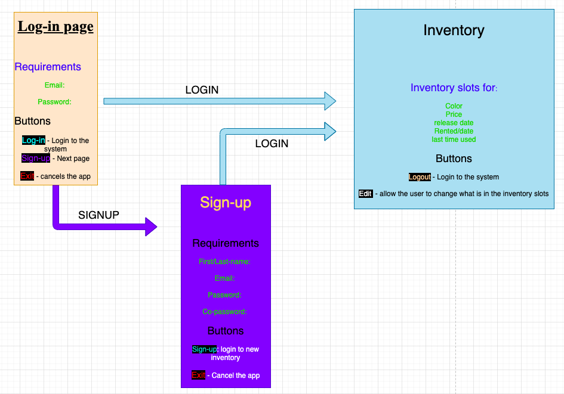

# Inventory App (Python)

Contents
-----
  1. [Planning](#planning)
  2. [Design](#design)
  3. [Development](#development)
  4. [Evalution](#evalution)
  
  Planning 
  ----------
  
  ## Definition of the Problem
A Company called HOTHAT is starting to open a business, they want to sell hats and also rent them to people for a day or so. This company has a lot of hats, and thier hats have different colors, prices, and release date and due to thier client's needs they provide a specific hat that they require. 

Kelven who is the owner of HOTHAT Company emailed me to help him keep track on how his Company. He stated in his emial that his company is having a diffucult time managing to know exactly how many hat they have. Kelven stated that sometimes his company loses track on hats and for result, they lose hats in the process. Kelven is afraid that he is afraid that his company will lose a lot of money if they keep losing hats which is bad for his business. So in order for his company to run smoothly and have a easy time managing all the hats that they either sell, rent or keep, he requires an application that will solve his problems like an Inventory. To know more about kelven's request, READ Client Request  
  
  ## Client Request (Directly from His Email)
"I would like to start a business company, called Hot Hats, and in my house, I already have a set of Hats. At this instant, I do not identify a way to know the number of hats that I have. The hats present different brands, colors, and styles and popularity. Besides registering these categories, I want the program to provide the current price, release date, loan price and last time used. Additionally, I want the system to be only assessed by me or the people who would work with me"


  ## Proposed Solution
To solve HOTHAT Company's problem we need to understand and figure out what kind of inventory a company like them will need. 
A simple inventory that divides into categories and those categories will have color, price, release date, rented hats, and
last time that it have been used. To make this possible, we will divide all the hats into the categories that the company requested and some of the categories will have sub class which will make it more easier. For example, Color catergory will have a sub class that shows different colors within that category. We will also create a search button that will make everything easier for Kelven and his company. Another feature that we will add is log in and registration so that only him or his workers could log in or use. Overall, the inventory need to be simple and easy to use by anyone in his company. 

 ## Record of Tasks
 
 The record of task contains the five steps in the design process: Planning, Design, Developement, testing, and implementaion
 
 
| __Task no__ | __Planning Action__ | __Expected Outcome__ |__Time Estimated__ |__Target Completion__ |__Criteria__ |
|-------------|---------------------|----------------------|-------------------|----------------------|-------------|
| 1        | Meeting with Client About a request he need   |  have a clear idea on what he wants his inventory to have and have a system sketch to create his inventory                    | 10 mins           | Feb 20th, 2020      |       A     |
|  2 | Defining the problem | Have a clear defined problem so that its easy to follow everything that need to be solved. its also an easy way to present when giving the client his application | 1 Hour|Feb 25nd, 2020 |A|
| 3     | Writing Solutions on Clients's request | There need to a clear solution at the end of this plan, and have everything that we need to start this application |1 Hour | Feb 28th, 2020| A |
| 4       | Creating Success Criteria |   I wanted to have a clear understandig on all the success criteria that I needed to meet in order to finish this program                | 10 mins           |feb 25th 2020| A| 
| 5        | Designing the application Using Qt Designer   |  Application form need to be done and at the end of this session, the application need to be ready for coding                    | 1 Hour           | March 10th, 2020                 |       C     |
| 6        | Converting the ui app file into python files  | I need to have python files that I can use for pycharm so that I can make the application work and have all the behaviours that the client requested  | 10 mins  | March 14th, 2020  | C |
| 7       |Create a mainapplication to unite all libraries for login, sighn, and mainpage| This mainapplicaiton will run the application as one| 1 Hour and 30 mins| April 3rd, 2020|C|
| 8        |Coding button Behavior| Whenever the buttons like login, signup, or exit clicked, they need to do exactly what they are intended to do. In this case, login need to take you into the inventory page, and signin need to take you to registration page while exit button cancels the application. | 1 Hour | April 6th, 2020| C |
| 9        |Reading a data File | withdraw data from another file which can help me store the data in my app | 30 mins | April 12th, 2020 | C |
| 10        | Designing the system Diagram | This will help me have a clear idea on what the application will look like and it will give the reader a cler over view of the app | 30 min | April 15th, 2020 | B |
| 11        | Coding for the login page | This will help the application to function properly and allow the user to login and log out of the system as he pleases  | 30 mins | April 23rd, 2020 | C |
| 12        | Creating the delete and save buttons for the main page | These two buttons will help the user alter data which is saved in their table | 20 mins | April 23rd, 2020 | C |


  ## Success Criteria
  These are all the criteria that our inventory will need to have
  1. Finding how many hats the client has.
  2. Categories for Brand, color, styles, popularity.
  3. providing a price for each hat and renting price.
  4. Date that it was realesed.
  5. When it was used(Last time it was used).
  6. Log-in and register system. 
  7. Editing
  8. Images

  Design 
  ----------

### The figure below shows an outline of the application



**Fig. 1.** SYSTEM DIAGRAM 

 

  Development 
  ----------
  
   ### Main page Library

```.py

from PyQt5 import QtCore, QtGui, QtWidgets
from PyQt5.QtWidgets import QDialog


class Ui_MainWindow(QDialog):
    def setupUi(self, MainWindow):
        MainWindow.setObjectName("MainWindow")
        MainWindow.resize(1020, 552)
        self.centralwidget = QtWidgets.QWidget(MainWindow)
        self.centralwidget.setObjectName("centralwidget")
        self.tableWidget = QtWidgets.QTableWidget(self.centralwidget)
        self.tableWidget.setGeometry(QtCore.QRect(0, 0, 1021, 341))
        self.tableWidget.setRowCount(10)
        self.tableWidget.setColumnCount(10)
        self.tableWidget.setObjectName("tableWidget")
        MainWindow.setCentralWidget(self.centralwidget)
        self.statusbar = QtWidgets.QStatusBar(MainWindow)
        self.statusbar.setObjectName("statusbar")
        MainWindow.setStatusBar(self.statusbar)

        self.retranslateUi(MainWindow)
        QtCore.QMetaObject.connectSlotsByName(MainWindow)

    def retranslateUi(self, MainWindow):
        _translate = QtCore.QCoreApplication.translate
        MainWindow.setWindowTitle(_translate("MainWindow", "MainWindow"))

```
  
  
  ### Login Library
  ```.py
  
  from PyQt5 import QtCore, QtGui, QtWidgets
from PyQt5.QtWidgets import QDialog


class Ui_Log_in(QDialog):
    def setupUi(self, Log_in):
        Log_in.setObjectName("Log_in")
        Log_in.setWindowModality(QtCore.Qt.WindowModal)
        Log_in.resize(500, 460)
        Log_in.setStyleSheet("QDialog {\n"
"background-color: rgb(163, 29, 25);\n"
"selection-background-color: rgb(29, 101, 255);\n"
"border-color: rgb(0, 0, 0);\n"
"color: rgb(252, 35, 67);\n"
"}\n"
"QPushButton {\n"
"    background-color: rgb(123, 129, 125);\n"
"}")
        self.layoutWidget = QtWidgets.QWidget(Log_in)
        self.layoutWidget.setGeometry(QtCore.QRect(180, 50, 157, 209))
        self.layoutWidget.setObjectName("layoutWidget")
        self.verticalLayout = QtWidgets.QVBoxLayout(self.layoutWidget)
        self.verticalLayout.setContentsMargins(0, 0, 0, 0)
        self.verticalLayout.setObjectName("verticalLayout")
        self.company_name = QtWidgets.QLabel(self.layoutWidget)
        font = QtGui.QFont()
        font.setPointSize(30)
        font.setBold(True)
        font.setWeight(75)
        self.company_name.setFont(font)
        self.company_name.setObjectName("company_name")
        self.verticalLayout.addWidget(self.company_name)
        self.Username = QtWidgets.QLineEdit(self.layoutWidget)
        self.Username.setMinimumSize(QtCore.QSize(0, 50))
        self.Username.setStyleSheet("Username {\n"
"    selection-background-color: rgb(252, 79, 88);\n"
"}")
        self.Username.setObjectName("Username")
        self.verticalLayout.addWidget(self.Username)
        self.Password = QtWidgets.QLineEdit(self.layoutWidget)
        self.Password.setMinimumSize(QtCore.QSize(0, 50))
        self.Password.setObjectName("Password")
        self.verticalLayout.addWidget(self.Password)
        self.LogIn = QtWidgets.QPushButton(self.layoutWidget)
        self.LogIn.setMinimumSize(QtCore.QSize(0, 25))
        self.LogIn.setObjectName("LogIn")
        self.verticalLayout.addWidget(self.LogIn)
        self.label = QtWidgets.QLabel(Log_in)
        self.label.setGeometry(QtCore.QRect(120, 140, 41, 20))
        self.label.setStyleSheet("color: rgb(255, 255, 255);")
        self.label.setObjectName("label")
        self.label_2 = QtWidgets.QLabel(Log_in)
        self.label_2.setGeometry(QtCore.QRect(110, 190, 61, 20))
        self.label_2.setStyleSheet("color: rgb(255, 255, 255);")
        self.label_2.setObjectName("label_2")
        self.Exit = QtWidgets.QPushButton(Log_in)
        self.Exit.setGeometry(QtCore.QRect(200, 320, 113, 32))
        self.Exit.setObjectName("Exit")
        self.reg_bt = QtWidgets.QPushButton(Log_in)
        self.reg_bt.setGeometry(QtCore.QRect(200, 270, 113, 32))
        self.reg_bt.setObjectName("reg_bt")

        self.retranslateUi(Log_in)
        QtCore.QMetaObject.connectSlotsByName(Log_in)

    def retranslateUi(self, Log_in):
        _translate = QtCore.QCoreApplication.translate
        Log_in.setWindowTitle(_translate("Log_in", "Dialog"))
        self.company_name.setText(_translate("Log_in", "HOTHATS"))
        self.LogIn.setText(_translate("Log_in", "Login"))
        self.label.setText(_translate("Log_in", "Email"))
        self.label_2.setText(_translate("Log_in", "Password"))
        self.Exit.setText(_translate("Log_in", "Exit"))
        self.reg_bt.setText(_translate("Log_in", "SignUp"))

  
  ```
  
### signup Library
  
  ```.py
  
  from PyQt5 import QtCore, QtGui, QtWidgets
from PyQt5.QtWidgets import QDialog


class Ui_SIgn_up(QDialog):
    def setupUi(self, SIgn_up):
        SIgn_up.setObjectName("SIgn_up")
        SIgn_up.resize(420, 451)
        SIgn_up.setStyleSheet("QDialog {\n"
"background-color: rgb(163, 29, 25);\n"
"selection-background-color: rgb(29, 101, 255);\n"
"border-color: rgb(0, 0, 0);\n"
"color: rgb(252, 35, 67);\n"
"}\n"
"QPushButton {\n"
"    background-color: rgb(123, 129, 125);\n"
"}")
        self.layoutWidget = QtWidgets.QWidget(SIgn_up)
        self.layoutWidget.setGeometry(QtCore.QRect(150, 50, 137, 175))
        self.layoutWidget.setObjectName("layoutWidget")
        self.verticalLayout_4 = QtWidgets.QVBoxLayout(self.layoutWidget)
        self.verticalLayout_4.setContentsMargins(0, 0, 0, 0)
        self.verticalLayout_4.setObjectName("verticalLayout_4")
        self.Labelsignup = QtWidgets.QLabel(self.layoutWidget)
        self.Labelsignup.setObjectName("Labelsignup")
        self.verticalLayout_4.addWidget(self.Labelsignup)
        self.Firstname = QtWidgets.QLineEdit(self.layoutWidget)
        self.Firstname.setText("")
        self.Firstname.setObjectName("Firstname")
        self.verticalLayout_4.addWidget(self.Firstname)
        self.Email = QtWidgets.QLineEdit(self.layoutWidget)
        self.Email.setObjectName("Email")
        self.verticalLayout_4.addWidget(self.Email)
        self.Password_4 = QtWidgets.QLineEdit(self.layoutWidget)
        self.Password_4.setObjectName("Password_4")
        self.verticalLayout_4.addWidget(self.Password_4)
        self.C_Password = QtWidgets.QLineEdit(self.layoutWidget)
        self.C_Password.setObjectName("C_Password")
        self.verticalLayout_4.addWidget(self.C_Password)
        self.SignUp = QtWidgets.QPushButton(self.layoutWidget)
        self.SignUp.setObjectName("SignUp")
        self.verticalLayout_4.addWidget(self.SignUp)
        self.label = QtWidgets.QLabel(SIgn_up)
        self.label.setGeometry(QtCore.QRect(29, 80, 101, 20))
        self.label.setStyleSheet("color: rgb(255, 255, 255);")
        self.label.setObjectName("label")
        self.label_2 = QtWidgets.QLabel(SIgn_up)
        self.label_2.setGeometry(QtCore.QRect(59, 110, 71, 20))
        self.label_2.setStyleSheet("color: rgb(255, 255, 255);")
        self.label_2.setObjectName("label_2")
        self.label_3 = QtWidgets.QLabel(SIgn_up)
        self.label_3.setGeometry(QtCore.QRect(59, 150, 71, 20))
        self.label_3.setStyleSheet("color: rgb(255, 255, 255);")
        self.label_3.setObjectName("label_3")
        self.label_4 = QtWidgets.QLabel(SIgn_up)
        self.label_4.setGeometry(QtCore.QRect(49, 180, 91, 20))
        self.label_4.setStyleSheet("color: rgb(255, 255, 255);")
        self.label_4.setObjectName("label_4")
        self.Exit_2 = QtWidgets.QPushButton(SIgn_up)
        self.Exit_2.setGeometry(QtCore.QRect(160, 230, 113, 32))
        self.Exit_2.setObjectName("Exit_2")

        self.retranslateUi(SIgn_up)
        QtCore.QMetaObject.connectSlotsByName(SIgn_up)

    def retranslateUi(self, SIgn_up):
        _translate = QtCore.QCoreApplication.translate
        SIgn_up.setWindowTitle(_translate("SIgn_up", "Dialog"))
        self.Labelsignup.setText(_translate("SIgn_up", "          Sign-Up"))
        self.SignUp.setText(_translate("SIgn_up", "SignUp"))
        self.label.setText(_translate("SIgn_up", "First/Last name"))
        self.label_2.setText(_translate("SIgn_up", "Email"))
        self.label_3.setText(_translate("SIgn_up", "Password"))
        self.label_4.setText(_translate("SIgn_up", "Co-Password"))
        self.Exit_2.setText(_translate("SIgn_up", "Exit"))

  
  ```
  

  Evalution 
  ----------
