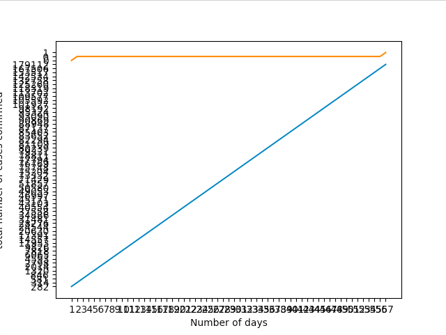

# Question #1

```.py

string = input("Input a string: ")
digit = 0 # define a variable called digit to store the given digits
letter = 0 # define a variable called letter to store the given letters
for i in string: # use for loop to repeat the process until every letter and digit is checked
    if i.isdigit(): # check each position of the given string to see if its digit or not
        digit = digit + 1 # if its digit then store it in digit value 
    elif i.isalpha(): # if its not a digit then check if its alpha which is a letter 
        letter = letter + 1 # if yes then store it in the letter value 
    else: # if its not both of them 
        pass # then pass and do nothing 
    
# you print both letter and digit 
print("Letters", letter)
print("Digits", digit)

```

# Question #2

```.py

num = int(input("Input a number: ")) # get an input from the user
for i in range (1, num+1): # use a for loop to repeat the process from 1 to given num
    d = {i:i*i} # define a variable in a dictionary
    print(d) # print d to get the values that are stored

```

# Question #3

```.py

seq = input("Enter words that are separated by comma: ") # get an input from the user
words = [word for word in seq.split(",")] # store the separated word into words
print(",".join(sorted(list(set(words))))) # print it by rearranging the words by its alphabetic order

```

# Question #4 

```.py

class cap:
    def __init__(self):
        self.string = input("Enter a string: ")

    def capitalization(self):
        print(self.string.upper())


convert = cap()
convert.capitalization()

```

# Question #5

```.py

age = int(input("Enter a dog's age: ")) # get an integer number

# you can have an if statement that shows if the age is less than zero then exit 
if age <= 2: # if the dog is two year then just print 21 or if its 1 then print 10.5
    dog_year = age * 10.5
else: # if not then subtract 2 from the age and then multiply by 4 and then add 21 
    dog_year = 21 + ((age - 2)*4)

print("The dog's age in dog's years is: ", dog_year)

```

# Question #6 (Data Analysis)



Blue line = cases of covid-19 confirmed around the world

Orange = cases of covid-19 confirmed around somalia

```.py

import matplotlib.pyplot as pyplot
import csv

with open('data.csv') as dt:
    data = []
    values = csv.reader(dt, delimiter=",")
    for row in values:
        data.append(row)
print(data)

x1 = data[0]
y1 = data[1]
pyplot.plot(x1, y1, label = "World cases")


x2 = data[0]
y2 = data[2]
pyplot.plot(x2, y2, label = "Somalia cases")

pyplot.xlabel('Number of days')
pyplot.ylabel('total number of cases confirmed')
pyplot.show()

```

Syllabus Questions:


# Question #1 ( one usability issue associated with the design of mobile devices)

"One usability issue comes with slow hardware. Mobile devices have improved for the best 10 year, now you have mobile devices
that can compete with computers when it comes to hardware, software, RAM, and Storage. But one downfall to a lot of mobile 
devices is the slow hardware, many phones slow down when you opens many apps making the phone to heat up and get laggy due 
to not having enough RAM to process all these apps."


# Question #2 (Make a table truth)


((a AND b) NOR c) = x

|a   |b   |c   |x|
|----|---|---|---|
|0   |0   |0   |1|
|0   |0   |1   |0|
|0   |1   |0   |1|
|0   |1   |1   |0|
|1   |0   |0   |1|
|1   |0   |1   |0|
|1   |1   |0   |0|
|1   |1   |1   |0|


# Question #3 (Define the term protocol)

According to TechTerms "A protocol is a standard set of rules that allow electronic devices to communicate with each other. 
These rules include what type of data may be transmitted, what commands are used to send and receive data, 
and how data transfers are confirmed."

Citation: “Protocol.” Protocol Definition, techterms.com/definition/protocol.


# Question #4

Memory data register(MDR) also known as Memory buffer register(MBR) is a register in the computer processor or
central processing Unit(CPU) which stores the data tranferred from and into the immediate access storage (eg. RAM). 
It acts like a buffer and holds anything that is copied from the memory ready for the processor to use it. 

Citation: “MDR(Memory Data Register) Holds the Toppr.com.” Toppr Ask, 
www.toppr.com/ask/question/mdrmemory-data-register-holds-the/.


Question #5 (colour in bits)

if you can store a colour in 7 bits how many different colours can be represented?
You can show number of colours that can be represented through this method
(2^x) x stand for number of bits that is stored in the colour.
(2^7) = 128 
you can have 128 different colours represented.
