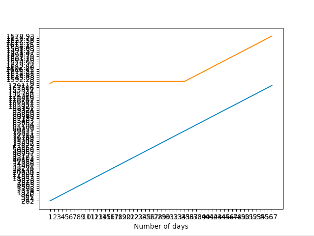

# Question 1

```.py

Firstname = input("Enter Your FirstName: ") # get the firstname
Lastname = input("Enter Your LastName: ") # get the lastname
num = int(input("Enter a number between 1 to 100: ")) # number used to generate the emails

for x in range (1, num+1): # using loop to do counter
    print(Firstname,".",Lastname,x,"@uwcisak.jp") # bring everything in one print, it will continue until num reach the input


```

# Question 2

```.py

import random
import string

def randompassword(passwordlength=20):
    passw = string.ascii_letters + string.digits + "()#$%&'=-~^|¥{}[]*+><?;:!"
    return ''.join(random.sample(passw, passwordlength))

inp = int(input("Enter a Number: "))

for x in range (1, inp+1):
    print ("Password: ", randompassword() )

```

# Question 3



Blue line = cases of Covid-19 confirmed around the world

Orange line = price of gold in USD during March month

The correlation coeffient of these two lines is that gold price in USD increases as the cases of covid-19 increases. In this case, we can say that there is a positive correlation as one increases the other one increases. The reason why the graph looks constant at the begining is because we are only interested in march so anything before that doesn't count. Also do to the pandemic that is happening around the world, we can figure that the gold price will go up because there aren't much market around the world thus resulting the price of gold to increase. 


Use the code below to find the correlation coefficient

CODE: Nikita Tiwari 

link: https://www.geeksforgeeks.org/program-find-correlation-coefficient/

```.py

def correlationCoefficient(X, Y, n):
    sum_X = 0
    sum_Y = 0
    sum_XY = 0
    squareSum_X = 0
    squareSum_Y = 0

    i = 0
    while i < n:
        # sum of elements of array X.
        sum_X = sum_X + X[i]

        # sum of elements of array Y.
        sum_Y = sum_Y + Y[i]

        # sum of X[i] * Y[i].
        sum_XY = sum_XY + X[i] * Y[i]

        # sum of square of array elements.
        squareSum_X = squareSum_X + X[i] * X[i]
        squareSum_Y = squareSum_Y + Y[i] * Y[i]

        i = i + 1

    # use formula for calculating correlation
    # coefficient.
    corr = (float)(n * sum_XY - sum_X * sum_Y) / (float)(math.sqrt((n * squareSum_X - sum_X * sum_X) * (n * squareSum_Y - sum_Y * sum_Y)))
    return corr


```

# Question 4

Motherboard - $2500

CPU processor - $1000

Monitor - $100

Graphic Card GPU - $500

RAM 16GB - $100

Storage (4T Hard Drive HDD, MODEL-ST4000DM005) - $100

computer Case - (Phanteks Enthoo Pro ATX) - $100

CPU cooling Fan - $100

power Supply - $40

operating system(Window 10) - $150

keyboard - $50

mouse - $10


Motherboard will be the first component we useas every other computer hardware will be attached to. Next step we take is 
connect it to a CPU that is comparable to the motherboard. Then we add the CPU cooling Fan as the CPU heats a lot so we need somehthing that could keep it cold. Then we attach all other components like RAM, and GPU and everything will be hold together by Computer Case so that everything is neat and organized. Then we link the hardware that we made to the monitor which we visualize everything, both Keyboard and mouse are attached to the monitor so that we can navigate the program. We give the computer a power through the power supply that we bought and we can install our Window 10 by storing everything in 4T HDD. After the window is installed, then you can use your computer. 
